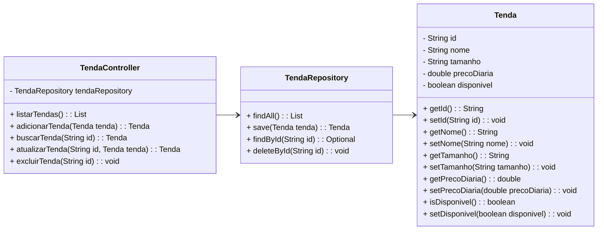

# API de Locação de Tendas

## Descrição

Este projeto implementa uma API RESTful para a gestão de locação de tendas, permitindo a realização de operações de CRUD (Criar, Ler, Atualizar e Excluir) no banco de dados MongoDB. Ele foi desenvolvido utilizando o **Spring Boot** e **Spring Data MongoDB**.

A API permite gerenciar as tendas disponíveis para locação, armazenando informações como nome, tamanho, preço diário e disponibilidade.

## Tecnologias Utilizadas

- **Spring Boot**: Framework Java utilizado para o desenvolvimento da API.
- **Spring Data MongoDB**: Integração entre o Spring Boot e o MongoDB.
- **MongoDB**: Banco de dados NoSQL utilizado para armazenar os dados das tendas.
- **Postman**: Ferramenta utilizada para testar a API.

## Funcionalidades

- **Listar todas as tendas**: Endpoint para buscar todas as tendas armazenadas no banco de dados.
- **Adicionar uma tenda**: Endpoint para adicionar uma nova tenda à base de dados.
- **Buscar uma tenda pelo ID**: Endpoint para buscar uma tenda específica utilizando o ID.
- **Atualizar os dados de uma tenda**: Endpoint para atualizar as informações de uma tenda.
- **Excluir uma tenda**: Endpoint para excluir uma tenda do banco de dados.

## DIAGRAMA DE CLASSES


## Endpoints

### 1. **Listar todas as tendas**  
**GET** `/tendas`  
Retorna todas as tendas registradas no banco de dados.

### 2. **Adicionar uma tenda**  
**POST** `/tendas`  
Adiciona uma nova tenda ao banco de dados.  

**Exemplo de corpo da requisição:**

```json
{
  "nome": "Tenda Grande",
  "tamanho": "10x10",
  "precoDiaria": 200.0,
  "disponivel": true
}
